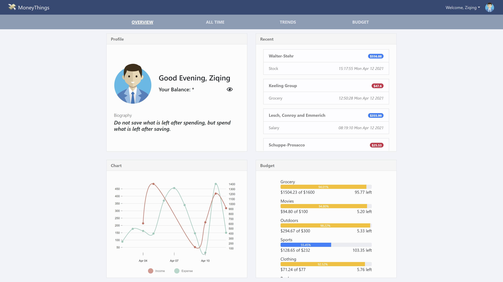
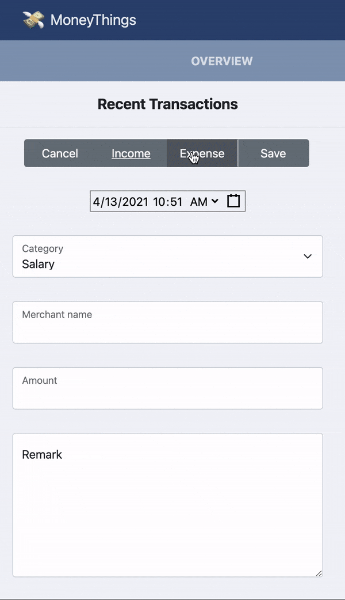
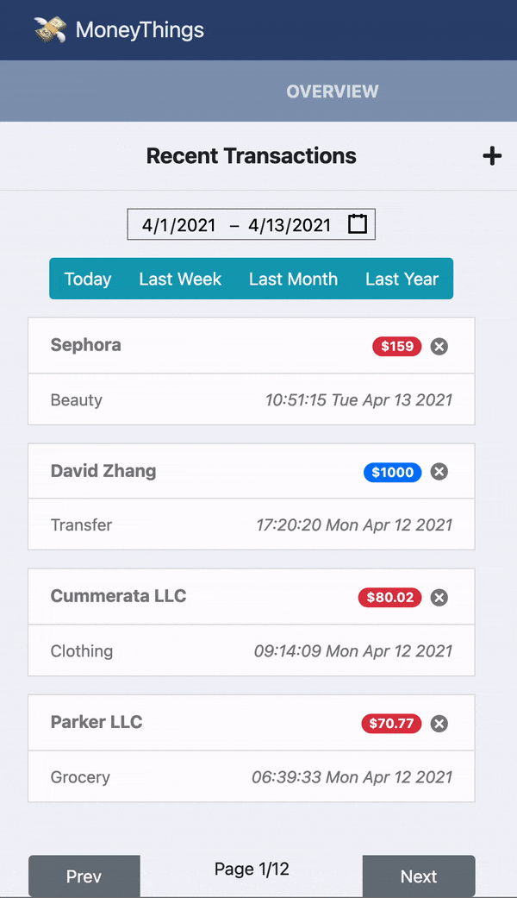
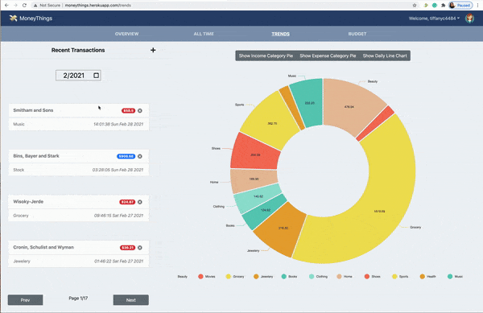
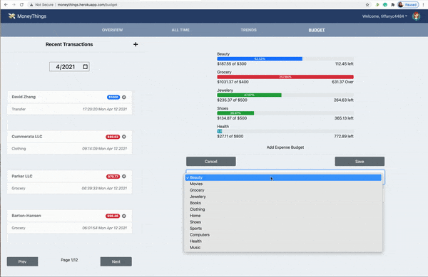

# MoneyThings

## Project Objective

MoneyThings is a desktop Single Page Application for personal finance management.



## Author
Qiqi Chen: chen.qiq(at)northeastern.edu

Ziqing Mao: mao.zi(at)northeastern.edu

## Links

Class link: [CS5610 Web Development](https://johnguerra.co/classes/webDevelopment_spring_2021/)

Demo Link: https://moneythings.herokuapp.com/

Video Demo: https://www.youtube.com/watch?v=

Slides: [Google Slides](https://docs.google.com/presentation/d/1y_3bIUTJU2RH0gSmEjfV3OPCCm_Lu_l-Vt82BG1s3_w/edit?ts=60740999)


## Project Structure

```
MoneyThings
├─bin                             // express entry
├─frontend                        // react project root
│  ├─build                        // react app bundle
│  ├─public                       // static files
│  │  ├─favicon
│  │  └─images
│  │      ├─avatar
│  │      └─avatar_thumbnail
│  └─src                          // react src
│      ├─auth                     // auth related components
│      ├─images
│      ├─shared
│      ├─stylesheets
│      └─tabs                     // different functional tabs
│          ├─account
│          ├─alltime
│          ├─budget
│          ├─dateRangeSelection
│          ├─overview
│          └─trends
├─routes                          // express routers
└─src                             // backend src
```

## Features

- Authentication system stores bcrypt + salted hashcode for sensitive data security
- Transaction data displayed in groups by either date or category
 
  Add Transaction
  
  </img>
  
  Delete Transaction
  
  </img>
  
- Data visualization by pie chart and line chart

  </img>
  
- Monthly Budget can be set and view by categories
  
  </img>
 
- Update account information including the password, the avatar, and the username   

## Online demo

```https://moneythings.herokuapp.com/```

## Development

For development, you need to start two servers
```
yarn install
cd frontend
yarn install
cd ..
yarn frontend
```
The frontend will run on http://localhost:3000
```
yarn backend
```
The backend will run on http://localhost:3001

Note: do not work on port 3001 as the express only provide api during development.

## Before deployment

```
cd frontend
yarn build (generate build folder)
cd ..
yarn backend
```
Check the webpage on http://localhost:3001

Don't push the build/ folder to your deployment server.

## Copyright
- This project is under [MIT license](./LICENSE). 
- Sample avatars of the demo are provided by [Iconfinder](https://www.iconfinder.com/iconsets/business-avatar-1) and they are under a free license.
